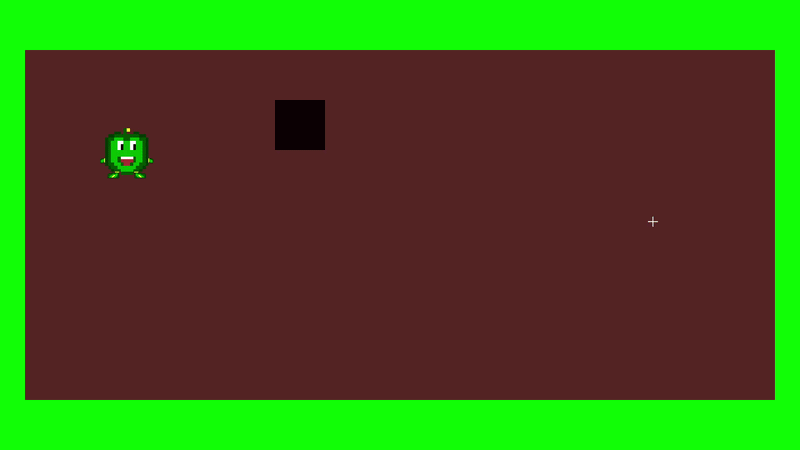

##### Note:
- If you're looking for representable code, check out my other repos, especially https://github.com/folayfila/FadoEngine. In my FadoEngine, I implement a lot of the conecpts used and leared here.

# HandMadeFolayfila
A 2D game engine from *scratch*, no libraries whatsoever, just good old C/C++ code.
This is an ongoing project following the amazing Handmade Hero course by Casey Muratori: https://guide.handmadehero.org/code/

